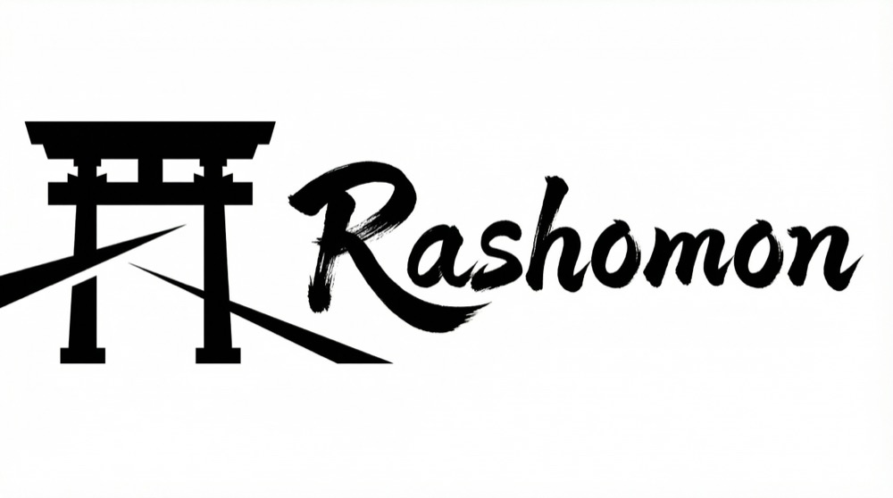

<p align="center">
  
</p>

<p align="center">
  <a href="https://claude.ai/code"></a>
  <a href="LICENSE"></a>
</p>

<p align="center">English | <a href="README.zh-CN.md">简体中文</a></p>

**Find out whether a skill improves agent behavior before you ship it.**

A capable model can follow a bad instruction very well. Unnecessary gates become unnecessary stops. Rigid procedures become extra work. Rules written around an older model's limitations can hold back a newer one.

In some cases, an agent performs better without the skill.

Rashomon tests that possibility. It runs the same task under a baseline and a changed version, then compares the results without revealing which version produced them. For skills, the result is a `ship`, `revise`, or `reject` recommendation.

## Quick Start

Rashomon is a [Claude Code](https://claude.ai/code) plugin. Skill evaluation requires Python 3.9 or later and Git 2.5 or later.

Start Claude Code:

```bash
claude
```

Add the marketplace and install the plugin:

```text
/plugin marketplace add shinpr/rashomon
/plugin install rashomon@rashomon
```

Restart Claude Code from the Git repository where you want to create the skill, then run:

```text
/recipe-eval-skill create
```

Rashomon asks a few questions about the skill, creates it, and tests it against a no-skill baseline. The final report recommends `ship`, `revise`, or `reject`.

## What Rashomon evaluates

| Evaluation | Comparison | Result |
|------------|------------|--------|
| New skill | Without the skill vs. with the skill | Whether the skill should ship |
| Updated skill | Previous version vs. revised version | Whether the revision is an improvement |
| Prompt | Original vs. optimized prompt | Whether optimization changes execution quality |

Rashomon can also conclude that the original prompt is already sufficient. A rewrite is not treated as an improvement by default.

## What you get

The report tells you which version won, what changed, and whether the difference held up across trials.

```text
Skill Quality: Grade A
- Project-specific rules are encoded clearly with no critical issues

Trigger Check: pass

Execution Effectiveness:
- Winner: with-skill
- Assessment: repeatable structural improvement across valid pairs
- Key difference: retry constraints and three-stage catch ordering were applied
  consistently across trials

Recommendation: ship
```

Grade A means the skill is ready to use. Grade B is usable with noted improvements. Grade C needs revision.

## How it works

The comparison focuses on observable results: correctness, completeness, constraint handling, and behavioral differences that recur across trials.

1. **Analyze the change.** Rashomon checks the skill or prompt for concrete instruction problems.
2. **Isolate execution.** Each version runs in a separate Git worktree from the same repository state.
3. **Run paired trials.** Repeated comparisons keep a single lucky result from deciding the outcome.
4. **Compare blind.** The evaluator judges output quality before learning which result came from which version.
5. **Make a recommendation.** Skill reports recommend `ship`, `revise`, or `reject`. Prompt reports return `Use optimized`, `Original sufficient`, `Needs refinement`, or `Collect more evidence`.

## Usage

### Create and evaluate a skill

```text
/recipe-eval-skill create
```

Rashomon collects the skill's purpose, domain knowledge, project-specific rules, and trigger phrases. It then creates the skill, reviews its quality, and compares agent behavior with and without it.

### Update and evaluate a skill

```text
/recipe-eval-skill <skill-name> <what to change>
```

For example:

```text
/recipe-eval-skill api-error-handling skill's scope needs adjustment
```

The current and revised versions are evaluated side by side.

### Evaluate a prompt

```text
/recipe-eval-prompt Add retry handling for HTTP 429 and 503 responses while preserving the client's public API
```

Rashomon analyzes the prompt, creates an optimized version when needed, and compares the original and optimized executions. Confirmed project-specific findings can inform later prompt evaluations.

You can also evaluate a prompt stored in a file:

```text
/recipe-eval-prompt Generate code following this skill: ./prompts/my-skill.md
```

### Use prompt optimization on its own

You do not need to run a paired evaluation every time you create or revise a prompt or skill. After installing the plugin, Claude Code or Codex may use `prompt-optimization` when it is relevant to the task. To make sure its principles are used, invoke it explicitly:

Claude Code:

```text
/prompt-optimization Create or review this prompt or skill
```

Codex:

```text
$rashomon:prompt-optimization Create or review this prompt or skill
```

`prompt-optimization` does not run paired trials. Use the full evaluation workflow when you need to verify the result through execution.

<details>
<summary>Install prompt optimization for Codex</summary>

Add the marketplace and install the plugin:

```bash
codex plugin marketplace add shinpr/rashomon
codex plugin add rashomon@rashomon
```

The Codex plugin includes `prompt-optimization` only. Rashomon's `/recipe-eval-skill` and `/recipe-eval-prompt` workflows remain available only in Claude Code.

</details>

## How results are classified

Different output does not necessarily mean better output. Rashomon separates four kinds of change:

| Classification | Meaning | Typical decision |
|----------------|---------|------------------|
| **Structural** | Accuracy, completeness, or execution quality improved | Use the new version |
| **Context Addition** | One version had useful project-specific knowledge | Use it when the context is accurate |
| **Expressive** | Wording changed but the result did not materially improve | Either version is acceptable |
| **Variance** | The difference is consistent with normal model variation | Keep the original or collect more evidence |

The report considers whether identified issues were resolved, whether required outputs and constraints were handled, and whether the same difference appeared across valid pairs.

[When Better Models Make Old Agent Workflows Worse](https://www.norsica.jp/blog/when-better-models-make-old-agent-workflows-worse) describes a real case where safeguards written for earlier models became the problem.

## Requirements

- Claude Code for `/recipe-eval-skill` and `/recipe-eval-prompt`
- Claude Code or Codex for standalone `prompt-optimization`
- Git 2.5 or later and a Git repository for evaluation workflows
- Python 3.9 or later for skill evaluation

## License

[MIT](LICENSE)
